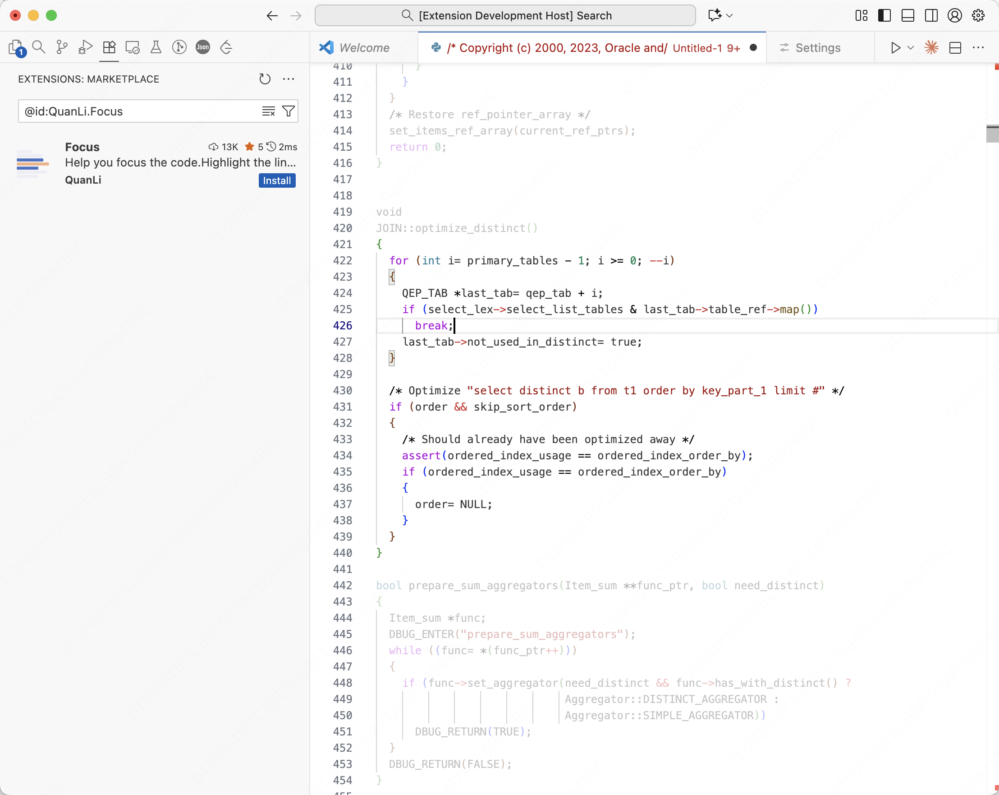

# Focus

[](https://marketplace.visualstudio.com/items?itemName=QuanLi.focus) [
](https://marketplace.visualstudio.com/items?itemName=QuanLi.focus)

Highlight code you are focused on.



## Features

* Highlight some lines around the cursor, and control how many lines.
* Highlight some lines that are wrapped in "{}", and control the level of "{}".

## Usage

* Install it.

## Configuration

Set how your code should be highlighted:

``` json
"focus.highlightRange":"block"  //Highlight code block which is ranged by `{` and `}`
"focus.highlightRange":"fixed"  //Highlight line count by configuration
"focus.highlightRange":"none"   //Disable highlight
```

When set to *block*, the configuration below controls the level of "{}":

``` json
"focus.autoMatchLevel":-1
```

When the level is set to *fixed*, configure how many lines to highlight:

``` json
"focus.highlightLines":5
```

Configure opacity:

``` json
"focus.opacity":0.7 //number between (0,1)
```

## Change Log
See Change Log [here](CHANGELOG.md)

## Issues
Submit the [issues](https://github.com/quantum-li/focus/issues) if you find any bug or have any suggestions.

## Contributing
Fork the [repo](https://github.com/quantum-li/focus) and submit pull requests.
